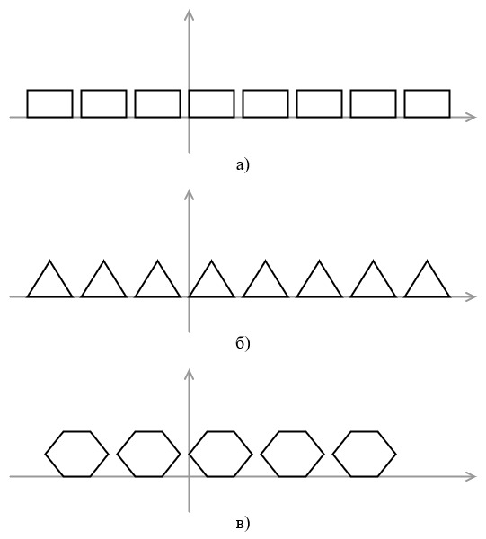
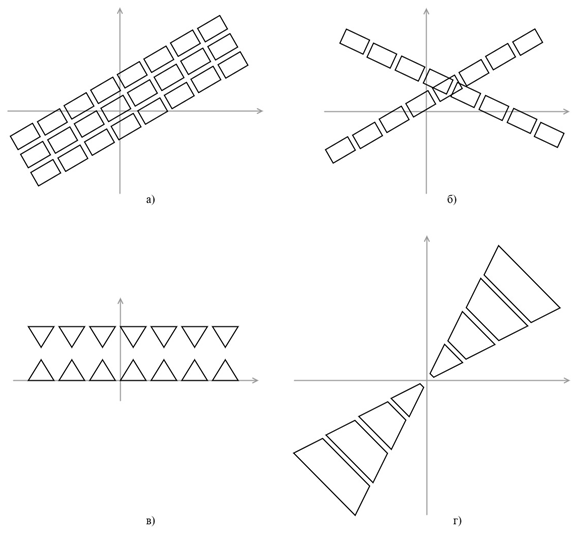
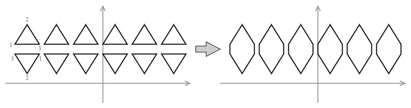

# fu-practicum-matplotlib-api

####  **ЗАДАНИЕ 2.** Реализация пакета модулей для манипулирования плоскими фигурами.

Реализовать API, которое позволяет генерировать, преобразовывать и визуализировать последовательность плоских полигонов,
представленных в виде картежа картежей (например: `((0,0), (0,1), (1,1), (1,0))` — представление для квадрата).
Последовательности представлений полигонов представляют собой итераторы (далее: последовательности полигонов). Решать
задачи с использованием функционального стиля программирования, в том числе активно использовать функции из модуля
`itertools` и `functools`.

## Задания

Суммарная сложность дополнительных заданий должна быть не менее 5.

### Задание 1

#### Требования

- **Обязательная часть**

#### Описание

Реализовать функцию визуализации последовательности полигонов, представленной в виде итератора (например, можно
использовать визуализацию с помощью библиотеки `matplotlib`, см.
пример: [ссылка](https://matplotlib.org/stable/gallery/shapes_and_collections/patch_collection.html#sphx-glr-gallery-shapes-and-collections-patch-collection-py)).

### Задание 2

#### Требования

- **Обязательная часть**

#### Описание

Реализовать функции, генерирующие бесконечную последовательность непересекающихся полигонов с различающимися
координатами (например, «ленту», см. рис. 2):

* прямоугольников (`gen_rectangle`);
* треугольников (`gen_triangle`);
* правильных шестиугольников (`gen_hexagon`).
* с помощью данных функций используя функции из модуля `itertools` сгенерировать семь фигур, включающих как
  прямоугольники, так и треугольники и шестиугольники, визуализировать результат.

Рисунок 2 — Последовательности непересекающихся полигонов

### Задание 3

#### Требования

- **Обязательная часть**

#### Описание

Реализовать операции:

* параллельный перенос (`tr_translate`);
* поворот (`tr_rotate`);
* симметрия (`tr_symmetry`);
* гомотетия (`tr_homothety`);

которые можно применить к последовательности полигонов с помощью функции `map`.

### Задание 4

#### Требования

- **Обязательная часть**

#### Описание

С помощью данных функций создать и визуализировать (рис. 3):

* три параллельных «ленты» из последовательностей полигонов, расположенных под острым углом к оси абсцисс;
* две пересекающихся «ленты» из последовательностей полигонов, пересекающихся не в начале координат;
* две параллельных ленты треугольников, ориентированных симметрично друг к другу;
* последовательность четырехугольников в разном масштабе, ограниченных двумя прямыми, пересекающимися в начале
  координат.

Рисунок 3 — Реализация операции параллельного переноса (а), поворота (б), симметрии (в) и гомотетии (г)

### Задание 5

#### Требования

- **2 пункта – обязательная часть**
- 4 пункта — сложность 1
- 6 пунктов – сложность 1

#### Описание

Реализовать операции:

* фильтрации фигур, являющихся выпуклыми многоугольниками (`flt_convex_polygon`);
* фильтрации фигур, имеющих хотя бы один угол, совпадающий с заданной точкой (`flt_angle_point`);
* фильтрации фигур, имеющих площадь меньше заданной (`flt_square`);
* фильтрации фигур, имеющих кратчайшую сторону меньше заданного значения (`flt_short_side`);
* фильтрации выпуклых многоугольников, включающих заданную точку (внутри многоугольника) (`flt_point_inside`);
* фильтрации выпуклых многоугольников, включающих любой из углов заданного многоугольника (`flt_polygon_angles_inside`);

которые можно применить к последовательности полигонов с помощью функции `filter`.

### Задание 6

#### Требования

- **1 пункт – обязательная часть**
- 3 пункта — сложность 1

#### Описание

С помощью данных функций реализовать и визуализировать:

* фильтрацию фигур, созданных в рамках пункта 4.4; подобрать параметры так, чтобы на выходе было получено шесть фигур;
* используя функции генерации из п. 2 и операции из п. 3, создать не менее 15 фигур, которые имеют различный масштаб, и
  выбрать из них (подбором параметра фильтрации) не более четырех фигур, имеющих кратчайшую сторону меньше заданного
  значения;
* используя функции генерации из п. 2 и операции из п. 3, создать не менее 15 фигур имеющих множество пересечений и
  обеспечить фильтрацию пересекающихся фигур.

### Задание 7

#### Требования

- **1 пункт – обязательная часть**
- 5 пунктов — сложность 1

#### Описание

Реализовать декораторы и продемонстрировать корректность их работы:

* фильтрующие многоугольники в итераторах среди аргументов функции, работающие на основе функций из п. 5:
  `@flt_convex_polygon`, `@flt_angle_point`, `@flt_square`, `@flt_short_side`, `@flt_point_inside`,
  `@flt_polygon_angles_inside`;
* преобразующие многоугольники в итераторах среди аргументов функции, работающие на основе функций из п. 3:
  `@tr_translate`, `@tr_rotate`, `@tr_symmetry`, `@tr_homothety`.

### Задание 8

#### Требования

- 3 пункта — сложность 1
- 5 пунктов — сложность 2

#### Описание

Реализовать функции и продемонстрировать их корректность:

* поиск угла, самого близкого к началу координат (`agr_origin_nearest`);
* поиск самого длинной стороны многоугольника (`agr_max_side`);
* поиск самой маленькой площади многоугольника (`agr_min_area`);
* расчет суммарного периметра (`agr_perimeter`);
* расчет суммарной площади (`agr_area`);

которые можно применить к последовательности полигонов с помощью функции `functools.reduce`.

### Задание 9

#### Требования

- 3 пункта — сложность 1

#### Описание

Реализовать функции и продемонстрировать пример их работы (если возможно, с визуализацией):

* склейки полигонов в одну последовательность полигонов из нескольких последовательностей полигонов
  `zip_polygons(iterator1, iterator2, [iterator3, ...])`. Пример:
    *
    `zip_polygons([((1, 1), (2, 2), (3, 1)), ((11, 11), (12, 12), (13, 11))], [((1, -1), (2, -2), (3, -1)), ((11, -11), (12, -12), (13, -11))])`
    * →
    *
    `[((1, 1), (2, 2), (3, 1), (1, -1), (2, -2), (3, -1)), ((11, 11), (12, 12), (13, 11), (11, -11), (12, -12), (13, -11))]`.

Альтернативный пример (визуализация) на рис. 4.

Рисунок 4 — Альтернативный пример склейки полигонов

* генерации `count_2D()` параметры: `(start1, start2)`, `[(step1, step2)]`, результаты: `(start1, start2)`,
  `(start1+step1, start2+step2)`, `(start1+2*step1, start2+2*step2)`;
* склейки полигонов в одну последовательность полигонов из нескольких последовательностей
  `zip_tuple(iterator1, iterator2)`. Пример:
    * `zip_tuple([(1,1),  (2,2), (3,3), (4,4)], [(2,2), (3,3), (4,4), (5,5)], [(3,3), (4,4), (5,5), (6,6)])`
    * →
    * `((1,1),  (2,2), (3,3)), ((2,2), (3,3) (4,4)), ((3,3), (4,4), (5,5)), ((5,5), (6,6), (7,7))`.
